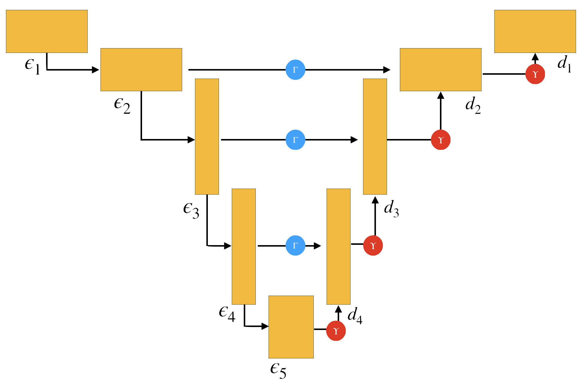
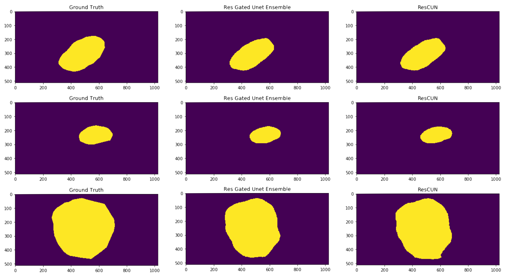

# Redefining U-Net
> Pasawee Wirojwatanakul
>
> Alex Sung-Min Hong

## Features
<p align="center"></p>

* In this study, we thoroughly studied U-Net and tweaked its architecture.

* We studied different techniques to fuse the feature-maps of the encoder of Residual U-Net with the feautre-maps of the decoder of Residual U-Net.

* To fuse the feature-maps, we experimented with addition, concatenation, Feature-wise Linear Modulations, Gate, and weighted combinations of feature-maps.

## Datasets
For this project, segmentation on skin-lesion medical images were used. 
We got the data from the ISIC-2017 competition, which contains 2000 images in the training set, 150 images in the validation set, and 600 images in the test set. The data can be downloaded from this [link](https://challenge.kitware.com/#phase/5840f53ccad3a51cc66c8dab).

## Dependecies

* Python 3.6 +
* Pytorch 1.2 +

## Run inference

After downloading the dataset, saving them into the directories into corresponding ones in `/data`. Then execute the command,
```
python train.py
```

The trained model will be saved into `/models`.

The performance can be evaluated by running [Evaluate.ipynb](Evaluate.ipynb).


## Results

Empirically, the ensemble of our top models is able to outperform [the plain U-net](https://arxiv.org/abs/1505.04597) by 4.66% on Pixel Accuracy, and 1.76% on the Jaccard Index.

<p align="center"></p>
